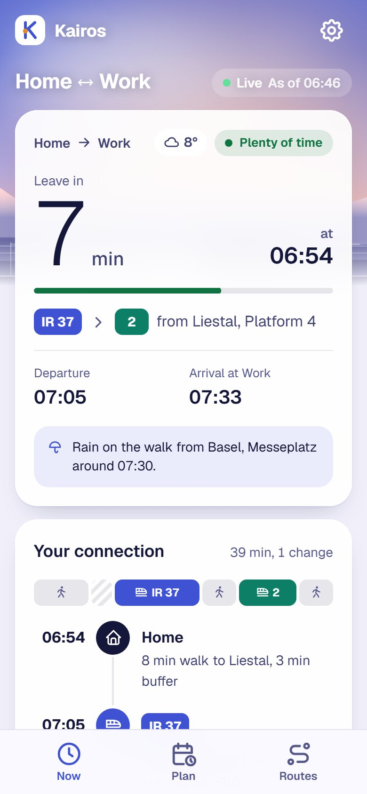
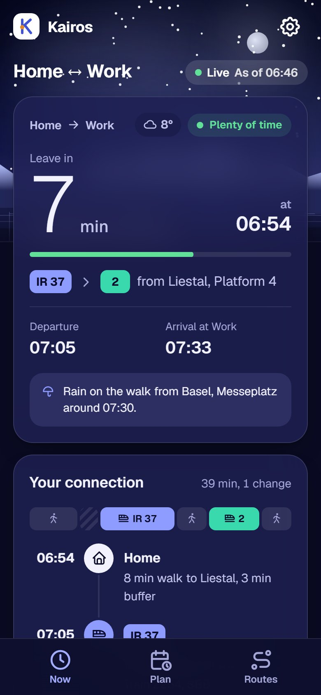
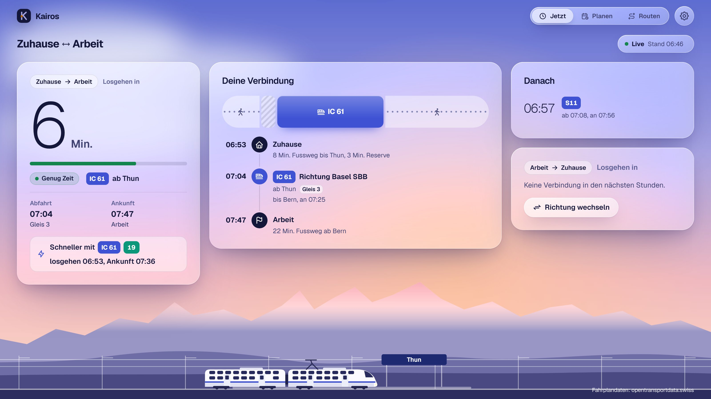
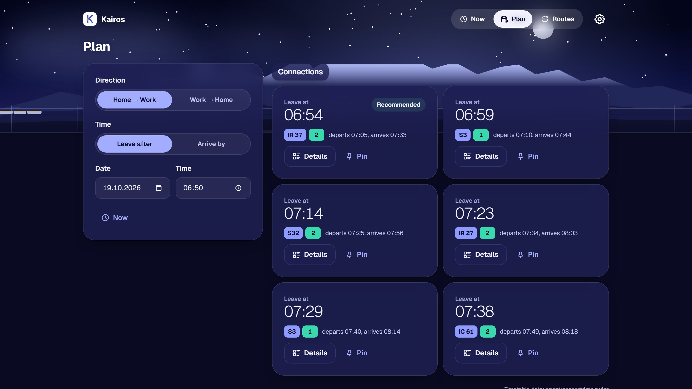
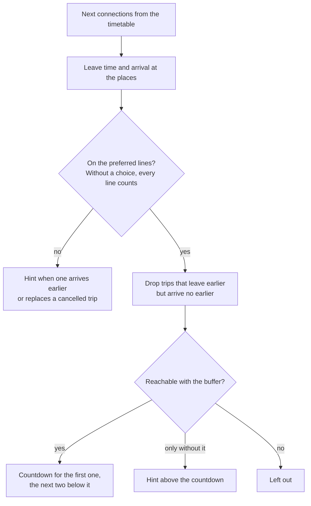
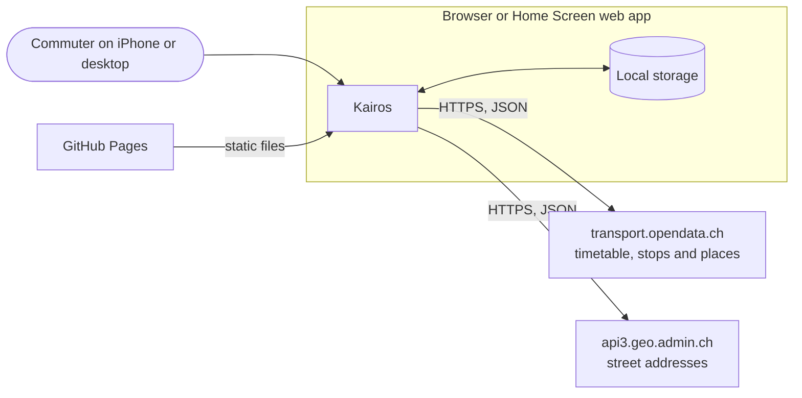
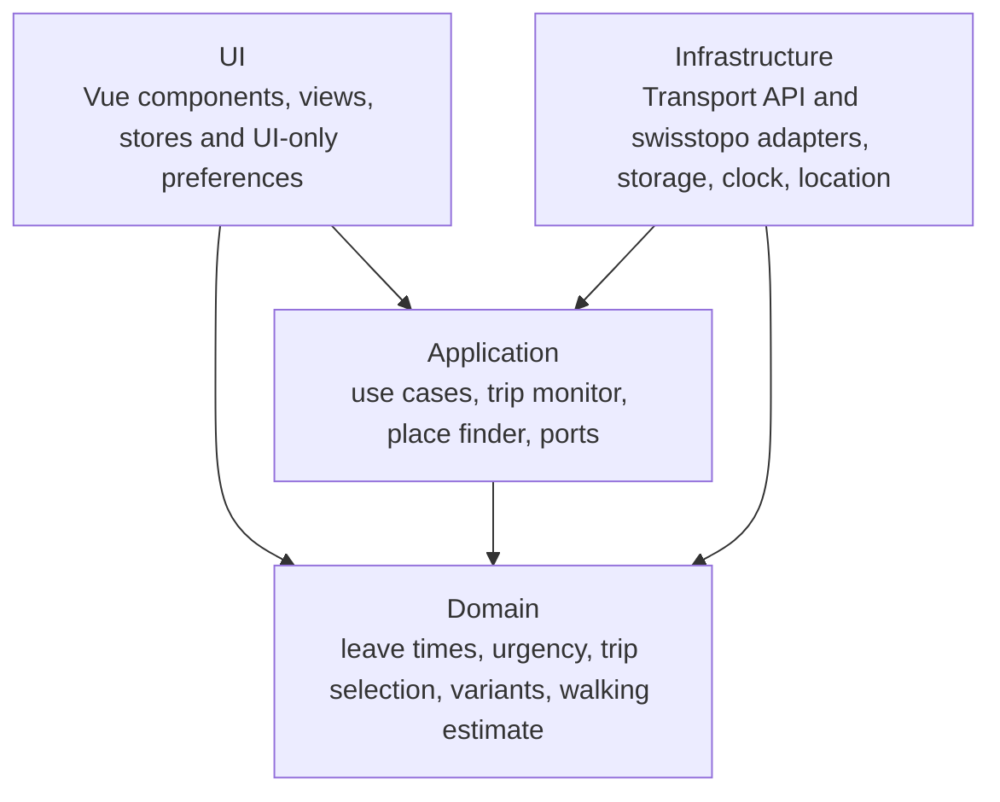
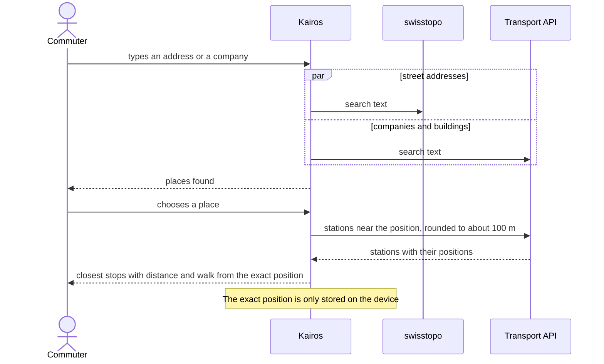

# Kairos

Kairos tells you when to leave the house to catch your train, bus or tram. It is a progressive web app for daily commuters in Switzerland: you set up the way between two places once, and from then on the app counts down the minutes until you have to walk out of the door, based on live timetable data, the walk to your stop and a small buffer.

[](https://github.com/ndum/kairos/actions/workflows/ci.yml)
[](https://github.com/ndum/kairos/actions/workflows/codeql.yml)
[](https://github.com/ndum/kairos/actions/workflows/pages.yml)
[](LICENSE)

## What it does

The board is the heart of the app. It shows the next connection of your route with a large countdown that turns from green to amber five minutes before you have to leave. Kairos always recommends the fastest connection: a trip that leaves earlier but does not arrive earlier is left out. When an earlier train is still within reach if you skip your buffer, a short hint says so. The other direction of the route is right next to it, one tap away.

Everything on the board is live. Delays of two minutes or more move the leave time, changed platforms stand out, and a trip on other lines that arrives earlier shows up as a hint. Every trip opens its details with the stops in between, the platforms, the train number and the operator. From there you can pin the trip, which then gets a countdown of its own, or let the route prefer its lines. The planner finds connections for a given departure or arrival time.

A route connects two places, for example home and work. You find a place by its address, by the name of a company or with your current position, and Kairos suggests the stops nearby with an estimate of the walk to each. In the last step you decide whether Kairos always takes the fastest connection, which is the default, or sticks to one of the usual variants or to lines of your choice. Routes can be shared with a link or a QR code, which never carry the positions of the places.

With access to the location, Kairos opens the board in the direction that starts where you are, and the board tells you whether the location or the time of day decided. The app installs on the iPhone Home Screen and on the desktop, starts offline with the last data it has, can keep the screen awake and comes in German and English, light and dark, built to WCAG 2.2 AA.

## Screenshots

<p align="center">
  
  &nbsp;
  
</p>





The screenshots use recorded timetable data and are captured from the production build with `npm run docs:screenshots`.

## How the leave time is computed

For every connection Kairos works backwards from the departure of the first vehicle:

```text
leave time = departure − walk to the stop − buffer
```

The walk to the stop is the walking time of the place plus any walk the timetable adds before the first vehicle. The buffer belongs to the route and is three minutes unless you change it. The arrival includes the walk from the last stop to the place.

From the next connections, the board picks its trips like this:



## Architecture

Kairos runs entirely in the browser and has no backend. Timetables, stops, companies and buildings come from [transport.opendata.ch](https://transport.opendata.ch), street addresses from the search service of [swisstopo](https://api3.geo.admin.ch). Routes, settings and the last known connections stay in the local storage of the device.



The code follows a hexagonal architecture. Dependencies point inwards, and ESLint fails the build when an import crosses a layer in the wrong direction.



Finding a place is the only moment a position leaves the device, and then only rounded:



The board keeps itself up to date. It asks the timetable every 30 seconds while the leave time is less than 20 minutes away, every two minutes up to two hours before and every ten minutes otherwise. It pauses while the app is in the background and catches up as soon as it is visible again.

A few decisions shape the code. Kairos is a progressive web app, so one code base serves the iPhone and the desktop. Without a backend, hosting stays static and free, and nothing about the user is stored anywhere but on the device. The timetable and the place search sit behind ports, so another source could replace transport.opendata.ch without touching the domain. Preferences that only affect the interface, such as the theme, stay in the UI layer, while everything with a meaning for the domain goes through a port.

## Tech stack

| Area         | Choice                                                    |
| ------------ | --------------------------------------------------------- |
| Framework    | Vue 3.5, TypeScript 6 (strict)                            |
| Libraries    | Vue Router 5, Pinia 4, Vue I18n 11, VueUse 15, Valibot 1  |
| Build        | Vite 8                                                    |
| Styling      | Tailwind CSS 4, Geist, Tabler Icons                       |
| Offline      | vite-plugin-pwa with Workbox                              |
| QR codes     | lean-qr                                                   |
| Tests        | Vitest 5 (unit and browser mode), Playwright, axe-core    |
| Code quality | ESLint 10, typescript-eslint, eslint-plugin-vue, Prettier |
| Git hooks    | Lefthook, commitlint                                      |
| Hosting      | GitHub Pages with pull request previews                   |

## Getting started

Requirements: Node.js 24.11 or later (26 recommended) and npm 11.

```bash
npm ci
npx playwright install chromium webkit
npm run dev
```

To try the app on an iPhone in the same network, start the development server with a self-signed certificate and open the printed network address in Safari:

```bash
npm run dev:lan
```

## Scripts

| Script                     | Purpose                                                     |
| -------------------------- | ----------------------------------------------------------- |
| `npm run dev`              | Development server                                          |
| `npm run dev:lan`          | Development server over HTTPS in the local network          |
| `npm run build`            | Type check and production build                             |
| `npm run preview`          | Serve the production build                                  |
| `npm run lint`             | ESLint, including the architecture rules                    |
| `npm run format`           | Format all files with Prettier                              |
| `npm run format:check`     | Check the formatting without changing files                 |
| `npm run typecheck`        | Type check with vue-tsc                                     |
| `npm test`                 | Unit and component tests in watch mode                      |
| `npm run test:unit`        | Unit tests                                                  |
| `npm run test:coverage`    | Unit tests with coverage                                    |
| `npm run test:browser`     | Component tests in Chromium and WebKit                      |
| `npm run test:e2e`         | End-to-end tests on an iPhone profile and desktop Chrome    |
| `npm run test:contract`    | Contract tests against the real Transport API and swisstopo |
| `npm run check:size`       | Check the JavaScript budget of the production build         |
| `npm run docs:screenshots` | Capture the screenshots of this README                      |

## Project structure

```text
src/
├── domain/          Models and rules, plain TypeScript
├── application/     Use cases and ports
├── infrastructure/  Adapters for the timetable, the address search, storage, clock and location
├── ui/              Vue components, views and styles
└── main.ts          Composition root
e2e/                 Playwright tests, including the accessibility checks
scripts/             Build plugins, the bundle budget, the coverage badge and the screenshots
docs/screenshots/    Screenshots of this README
```

## Privacy and security

Kairos has no account, no tracking and no cookies. Routes and settings stay on the device. A shared link carries routes, but never the positions of places. To choose the direction of the board, the position of the device is only used on the device itself.

The place search sends what you type to swisstopo and to the Transport API. To find the stops near a place, including one taken from the current position, it sends the position rounded to about a hundred meters. The page comes with a strict Content Security Policy that allows connections to these two services only.

## Quality gates

Every pull request runs linting, formatting and type checks, unit tests with at least 90 percent coverage of the domain, application and infrastructure layers, component tests in Chromium and WebKit, end-to-end tests with accessibility checks, the JavaScript budget of 100 KB and a Lighthouse audit with a minimum score of 95 in every category. CodeQL scans every pull request and the whole code once a week. A nightly workflow runs the contract tests against the real services, and Dependabot keeps the dependencies current.

## Deployment

Pushes to `main` are published to [ndum.github.io/kairos](https://ndum.github.io/kairos/), together with the coverage figure behind the badge above. Every pull request gets a preview under `ndum.github.io/kairos/pr-preview/pr-<number>/`, which is removed when the pull request is closed. The build consists of static files only and can be served from any web server.

## Contributing

Contributions are welcome. Please read the [contributing guide](CONTRIBUTING.md) and the [code of conduct](CODE_OF_CONDUCT.md).

## Data sources and credits

Timetable data: [opentransportdata.swiss](https://opentransportdata.swiss), provided through the [Transport API](https://transport.opendata.ch) of Opendata.ch. Companies and buildings: © [OpenStreetMap](https://www.openstreetmap.org/copyright) contributors, through the same API. Street addresses: © [swisstopo](https://www.swisstopo.admin.ch).

The interface is set in [Geist](https://github.com/vercel/geist-font) under the [SIL Open Font License 1.1](public/licenses/geist-font.txt) and uses [Tabler Icons](https://tabler.io/icons) under the MIT License.

## License

[MIT](LICENSE) © Nicolas Dumermuth
