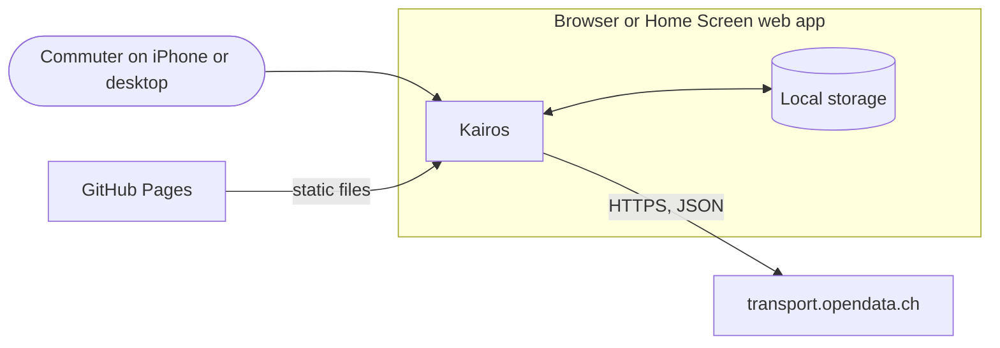
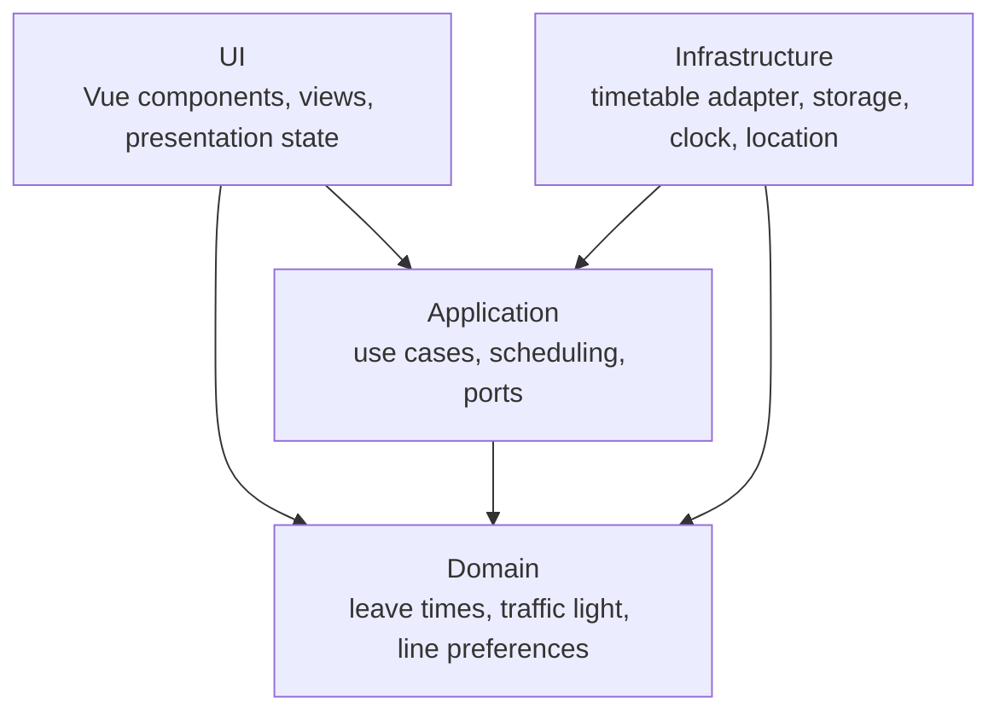

# Kairos

**Know exactly when to leave.** Kairos is a progressive web app for daily commuters in Switzerland. It counts down the minutes until you have to walk out of the door, based on live timetable data, your walking time and the reserve you want to keep.

[](https://github.com/ndum/kairos/actions/workflows/ci.yml)
[](https://github.com/ndum/kairos/actions/workflows/codeql.yml)
[](LICENSE)

> [!NOTE]
> Kairos is under active development towards version 1.0. The features below describe the scope of that release.

## Features

- **Leave-in countdown** for both directions of a route, with a traffic light that turns amber shortly before you have to leave and red once a connection is only reachable without your reserve.
- **Live data** for delays, platform changes, cancellations and connections at risk.
- **Routes** between two places, each with its stop, walking time, reserve and preferred lines. Routes can be shared with a link or a QR code.
- **Planning** by arrival or departure time, with a pinned trip that gets its own countdown.
- **Automatic direction** based on your location on the phone and on the time of day elsewhere.
- **Offline start** with the last known data, installable on the iPhone Home Screen and on the desktop.
- German and English, light and dark appearance, built to WCAG 2.2 AA.

## How it works

For every connection Kairos works backwards from the departure:

```text
leave time = departure − walking time − reserve
```

The countdown always shows the first connection you can still reach with your full reserve. If an earlier one is only reachable without the reserve, Kairos shows it as a hint above. Delays of two minutes or more shift the leave time, the reserve stays untouched.

## Architecture

Kairos runs entirely in the browser. It reads timetable data from [transport.opendata.ch](https://transport.opendata.ch) and keeps routes and settings on the device.



The code follows a hexagonal architecture. Dependencies point inwards and are enforced by ESLint.



The reasoning behind these choices is recorded in the [architecture decision records](docs/adr/README.md).

## Tech stack

| Area         | Choice                                                    |
| ------------ | --------------------------------------------------------- |
| Framework    | Vue 3.5, TypeScript 6 (strict)                            |
| Build        | Vite 8                                                    |
| Styling      | Tailwind CSS 4                                            |
| Tests        | Vitest 5 (unit and browser mode), Playwright              |
| Code quality | ESLint 10, typescript-eslint, eslint-plugin-vue, Prettier |
| Git hooks    | Lefthook, commitlint                                      |
| Hosting      | GitHub Pages with pull request previews                   |

## Getting started

Requirements: Node.js 24.11 or later (26 recommended) and npm 11.

```bash
npm ci
npx playwright install chromium webkit
npm run dev
```

To try the app on an iPhone in the same network, start the development server with a self-signed certificate and open the printed network address in Safari:

```bash
npm run dev:lan
```

## Scripts

| Script                  | Purpose                                                  |
| ----------------------- | -------------------------------------------------------- |
| `npm run dev`           | Development server                                       |
| `npm run dev:lan`       | Development server over HTTPS in the local network       |
| `npm run build`         | Type check and production build                          |
| `npm run preview`       | Serve the production build                               |
| `npm run lint`          | ESLint, including the architecture rules                 |
| `npm run format`        | Format all files with Prettier                           |
| `npm run typecheck`     | Type check with vue-tsc                                  |
| `npm test`              | Unit and component tests in watch mode                   |
| `npm run test:coverage` | All Vitest tests with coverage                           |
| `npm run test:e2e`      | End-to-end tests on an iPhone profile and desktop Chrome |
| `npm run check:size`    | Check the JavaScript budget of the production build      |

## Project structure

```text
src/
├── domain/          Models and rules, plain TypeScript
├── application/     Use cases and ports
├── infrastructure/  Adapters for the timetable API, storage, clock and location
├── ui/              Vue components, views and styles
└── main.ts          Composition root
e2e/                 Playwright tests
docs/adr/            Architecture decision records
```

## Quality gates

Every pull request runs linting, formatting and type checks, unit and component tests in Chromium and WebKit, end-to-end tests, the JavaScript budget of 100 KB and a Lighthouse audit with a minimum score of 95 in every category. CodeQL scans the code weekly and Dependabot keeps dependencies current.

## Deployment

Pushes to `main` are published to [ndum.github.io/kairos](https://ndum.github.io/kairos/). Every pull request gets a preview under `ndum.github.io/kairos/pr-preview/pr-<number>/`, which is removed when the pull request is closed. The build consists of static files only and can be served from any web server.

## Contributing

Contributions are welcome. Please read the [contributing guide](CONTRIBUTING.md) and the [code of conduct](CODE_OF_CONDUCT.md).

## Data source

Timetable data: [opentransportdata.swiss](https://opentransportdata.swiss), provided through the [Transport API](https://transport.opendata.ch) of Opendata.ch.

## License

[MIT](LICENSE) © Nicolas Dumermuth
